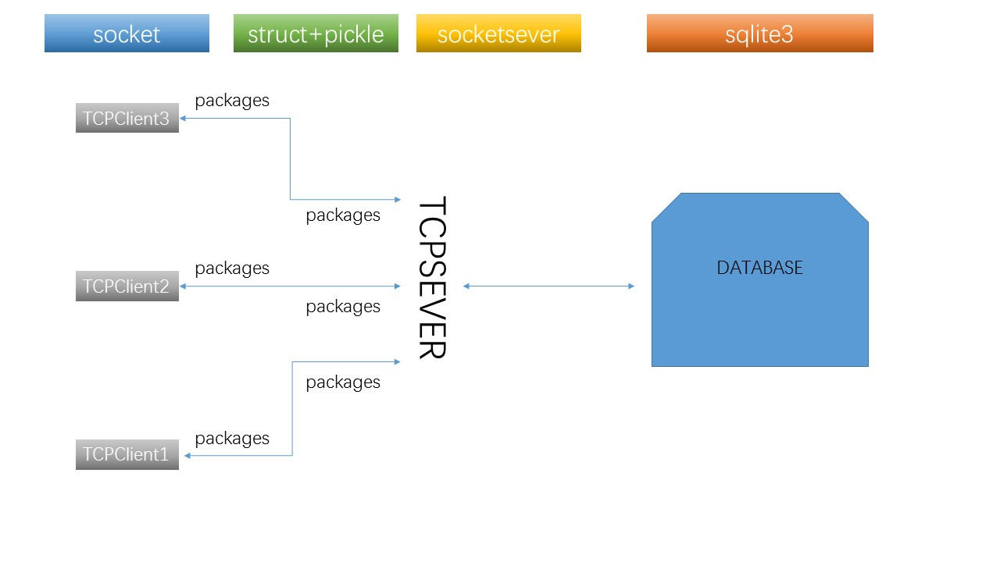
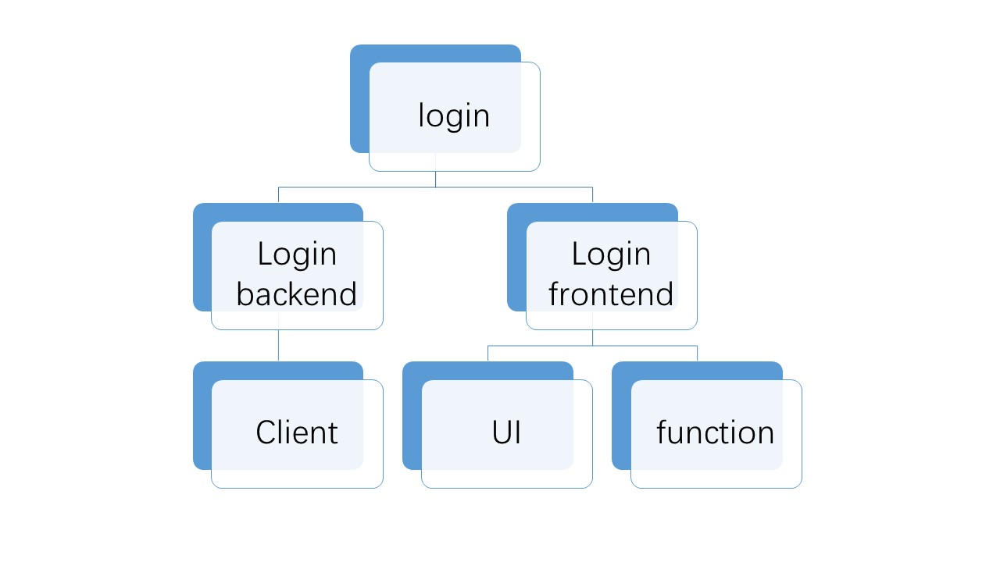
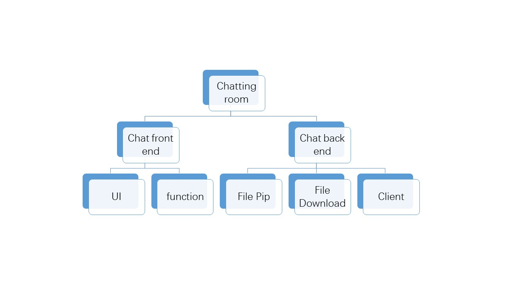

# CS902大作业汇报——Ty's chatting room

##功能实现

该项目具体实现的功能：

- 多人在线聊天支持图片和文字
- 云盘功能，可以上传和下载该聊天室中的公共文件
- 基本用户逻辑的实现（包括用户注册，修改资料，登陆）

##技术栈

该项目的主要用到的语言为python，附加QSS作为专属的Qt的美化方式，用到的主要库为：

- PyQt5，主要用于实现我们的友好界面
- socketserver：用于服务器的实现
- sqlite3：用于操作sqlite数据库
- struct，pickle用于服务器和客户端的数据传输处理
- json 用于处理历史消息的文件存储
- os，主要用于对文件的一些处理和查询
- re，正则从文字中得到一些信息
- PIL，用于处理用户上传的聊天图片，进行大小的修改

## 基本模式

简介：我们整体的架构是如上图，大致分为两个部分，一个是**服务器**，一个是**客户端**，服务器端主要要负责对各项数据的传输和任务的处理，客户端主要负责得到用户的输入传输到服务器，并且实时展示一些信息给用户作为反馈

#### 服务器

服务器中存在多项任务逻辑，我们用每个不同的函数来处理不同的任务

#### 客户端

客户端主要注重与前后端分离，前后端的关系建立主要使用Qt的信号槽机制进行处理

## 作品展示

1. 正常的**注册**与**登陆**（两个账号的展示），展示托盘的隐身和在线功能

2. 正常的单人**修改**自己的信息
3. 正常的双人**聊天**，展示一个托盘显示消息
4. 展示文件**上传**和**下载**

## 项目中遇到的困难

1. 协议的设定——1+n*(x,y)
2. 服务器的工作方法——dict函数指针
3. 阿里云服务器的设置——python3.5的安装和服务器防火墙+tmux
4. 前后端解耦和封装——信号槽机制
5. 用户友好（界面+托盘）

## 本项目的优点：

1. 前后端分离、封装成功
2. 代码风格统一，注释明了
3. 开发遵循原型法，最开始产出的代码主要围绕tcp服务器和客户端进行主要针对的是聊天功能的实现
4. 开发过程规范，进行开发的日子中都有开发日志，代码在git上都打有标签，并保存在github本人的repo下
5. 界面较为美观，使用流畅
6. 能够切实的使用，在服务器上能够流畅的运行（在阿里云服务器正常的情况下）
7. 可扩展性强，可继续增添新的功能，例如现在正在开发的历史消息查看功能