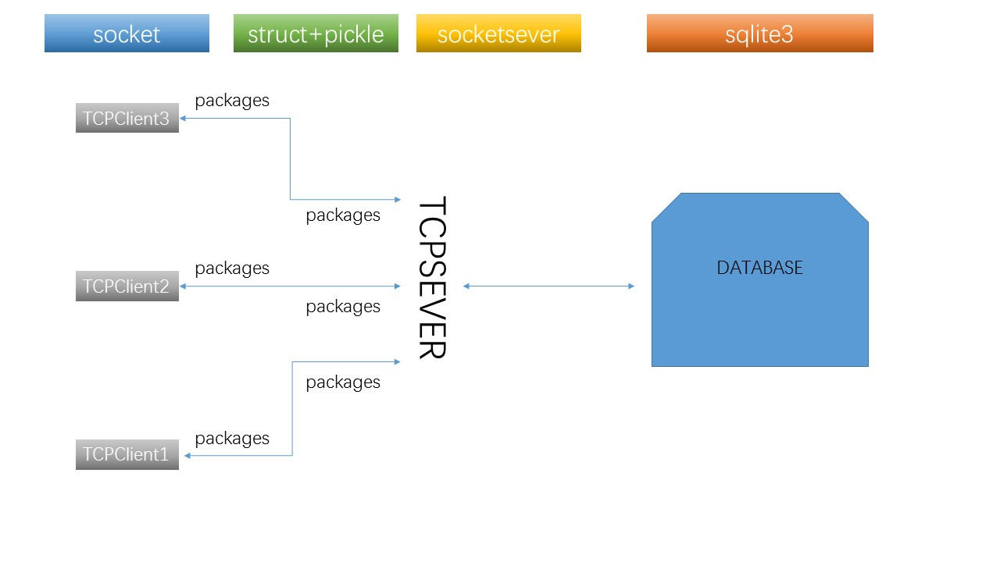

# Ty's Online Chatting Room

## 一、立项

本项目为2017年程序设计大作业，意在使用pyQt5实现一个简单的在线聊天室

### 开发环境要求

pyQt+python3.5+sqlite3

硬件方面：阿里云 CentOs7+1核+内存2G（阿里云学生机）

###开发前的目标

该部分的具体设想写于2017年11月23日，在后期开发过程中可能会修改我们的目标，在最后会有一个达成情况的陈列。

我们希望能够完成的目标：

1. 实现一个用户类，包含用户的相关信息，储存在服务器的数据库当中，用户拥有的功能有：登陆、修改部分个人信息（能修改一个，则其他的都能修改，为节约时间仅表现可实现性）。
2. 实现一个用户**在线聊天功能**和一个**公共文件上传功能**，聊天记录和文件在服务器可以进行储存
3. 使用pyQt designer设计好用户界面

## 二、开发日志

#### 11月25日

搭建环境，测试pyQt的基本功能，测试python中需要用的到的sqlite3，struct，pickle库，整个业务逻辑基本如下：

​	

具体阐述下其中几个关键的部分：

1. packages设定。

   由于TCP协议接受发送信息必须是二进制的，但是python本来是排斥二进制的，并且TCP服务器和客户端接受信息都是每一次达到最大值之后再返回，基于这个点，我们对于package的要求要更高，经过多次探索和百度，我们找到了正确的方法，使用strut+pickle，我们的包有一下固定的格式：

   - 一个数字，由struct生成，用于表示指令
   - 一个数字，由struct生成，用于表示结构体长度
   - 一个结构体，用于进行操作，有pickle产生

2. 服务器的业务逻辑

   我们的服务器段有一个字典，专门存放指针函数，用于处理业务逻辑，在用户发包时，先处理前四个字节，得到具体的指令，利用该business字典调用具体的函数进行第二个部分的数据读取，对结构体进行操作。

在11月26日主要进行的是聊天界面的搭建（涉及一些pyQt的技术）和服务器业务逻辑方面的源码积累。

#### 11月26日

今天实现了登陆功能，进入到了聊天室界面的设计

聊天室界面在不断的探索之后主体还是用QTextbrowser实时显示，（我们应当会增加一个发送图片的功能），但这会改动我之前粗糙的聊天室ui界面，这部分的代码可能需要移植，将该任务暂时挂起，待其他的部分都完善好了之后再进行页面的设计。

对我们的服务器端和客户端进行了一些封装，代码可读性大大提高。

我们的项目使用简单的轮询机制来获得信息，我们的信息会暂时存在一个list中，利用轮训机制最终本地服务器得到我们的数据，我们要查看消息记录的话，只需要访问本地的消息记录就好（当然可能实现不了你在查询记录的时候发送过来几条的实时更新）

现在就怕这我的服务器不能承载这一切。

我们的文件上传下载的功能的基本知识已经习得 

#### 11月27日

双人在本地模拟进行测试两天已经完成，明天测试一下三人的效果，比较害怕的是担心list会不会不支持多线程操作，出现一些奇怪的问题。上线部分的情况比较糟糕，服务器出现了一些问题，需要调试服务器内部的文档，依旧是比较害怕去动这些文档，程序整体的正常显示没有问题，明后天先完善好一些小的部件（显示是否在线，进入房间提醒，创建用户，修改密码）

#### 11月28日

由于ddl较多，没有办法只能选择先做一些简单的工作，对整个程序进行解耦

![![img]decoupling](decoupling2.jpg)

我们这里重点讲一讲chatting room 的一个封装，因为相对而言他更加的大和全面

因为我们使用Qt designer设计的界面转化为python代码后的格式是固定的套路，我们必然后在设计的过程中反复的修改界面部分的代码，所以我们得单独把UI基本的独立出来，使得每一次修改的成本更低，避免“修改一个位置label位置，改了整个文档一次这种情况”

为了使得代码看起来更加简介和封装更加的优秀，最终决定在把服务端再做一次封装，也是为了日后的File Pip和File Download模块进行一个预设，让加上Client之后的三个板块统归在Chat back end下，我们的Chatting room的搭建一方面是为了一个对前后端的整体封装，最主要的是建立前后端的信号与槽的connect，这样这个聊天室的基本程序框架才是真正的展现了出来。

此外，python传参的有事也是展现出来，我们在login当中创立的链接并不断掉，直接作为参数传入后面的chatting的链接。

在当天晚上的File Pip和File Download 的单元测试已经成功，之后导入模块实现真正的功能应该是非常快的。

#### 11月29日

关于tabwidget和tablewidget部分的美化代码暂时搁置，首先弄清楚了这两个东西的使用方法，之后进行了一些测试的页面设计，最后总确定我们的整个界面的大致布局（也是多亏之前的code review ，让修改页面变得非常的简答，不需要大规模的移动代码）

####11月30日

基本实现了实时人数的展示，准备实现双击user即可查看其基本信息

发现整个程序没有一个正规的出口，准备找一个官方的出口，这个地方着实是费了不少功夫，要让几个分支进程告诉服务器我要退出，进行信息上的一些删除，然后在本地关闭线程，界面消失。

#### 12月1日

使用的时候发现一些地方似乎还可以再进一层的封装是代码重用和代码可读性增强，这个地方考虑后期再做一次code review，之后实现了在测试阶段上传文件的本地显示和更新方法的一部分，聊天图片的插入按钮添加完成，用户文件下载功能完成。

#### 12月2日

实现了修改用户信息，用户文件上传功能，用户注册功能，基本了解到qtextbrowser可以使用html代码，则我们后面给用户提供字体设置和聊天图片显示都使用html进行美化（这里突然思考到我们图片的大小是一个很大的问题）

#### 12月3日

发现图片功能出现了一些问题，服务器python准备升级为python3.5（Centos默认为是装python2.7.5）这之间操作发生了失误导致了，我两个版本的python都出现了问题，但暂时没有时间去修复，甚至我还妄想着能够使用python2在网上实现服务器的功能，因而我把python3写法的server转换为python2的写法，上传到了网上，发现很多地方都不匹配，例如pickle在python2中只有0，1，2三种协议模式，默认为1，但是python3中pickle有0，1，2，3，4，5种协议方式，且默认为3（当然这个很好解决），还有旧式python2打开文件的‘rb’模式只是说安装二进制长度去读取文件，读出来之后还是会转化为str，但是python3是的的确确读出二进制文件，这一点也是我经过实验之后得到的。

这迫使我不得不还是使用python3，那我就得重装系统（TAT）

之后我有找到了打包该程序的方法，我选择了其中的一种，使用pyInstall对我们的脚本进行打包，他具体的原理是把编译器和你的文档绑定在一起（这样程序的效率其实是比原来用文档慢的）

#### 12月4日

一整天都是在重装系统，设置安全组，将原来服务器上本来就有的网站再一次运行（搭这个环境用了不少），之后下载tmux把网站的部分先解决了，开始在服务器上进行代码调试，一开始无论如何也连接不上服务器，查了很久最后发现是重装系统之后原来的端口在防火墙上没有开启。

#### 12月19日

对该软件当中的一些bug进行了调试，对于自己服务器的网速无力吐槽，在本地调试基本没有问题，我再一次加强了在服务器上的一个调试，在server上进一步做了封装，但是还是由于服务器的问题（主要是及其不稳定），最终决定在本地进行展示！

####1月3日

添加托盘化功能，提供在线隐身功能（在托盘中触发），有消息可以图标会修改，隐身将切换在聊天室的状态和托盘图标

#### 1月5日

添加QSS进行美化，为下载部分添加一个进度条，QSS方面对页面做了紧急的一个美化，暂时能看了不少

#### 1月10日

准备展示